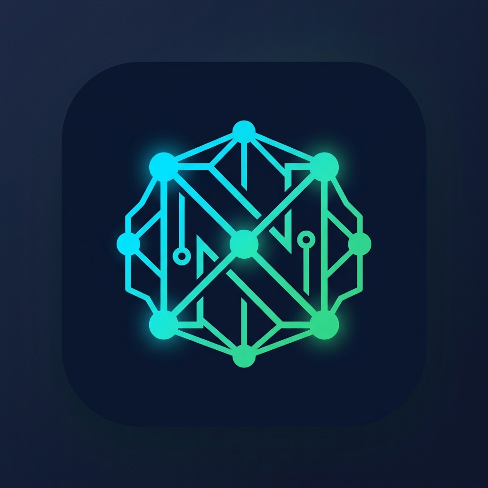

<div align="center">
  
  <h1>Nexora AI — Intelligent Support SaaS</h1>
  <p>The next-generation autonomous customer support operating system powered by AI.</p>
</div>

## 🚀 Overview

Nexora AI is a modern SaaS platform designed to revolutionize customer support operations. By combining traditional support ticketing with advanced AI-driven resolution, real-time analytics, and Vector RAG (Retrieval-Augmented Generation) pipelines, Nexora AI empowers support teams to scale effortlessly without sacrificing quality.

## ✨ Main Features

* **🤖 AI Co-Pilot & Autonomous Resolution**
  Automatically resolves high-confidence tickets instantly. Provides agents with smart suggested replies, sentiment analysis, and confidence scores for complex queries.
* **📚 Vector Knowledge RAG Pipeline**
  Ingest and index your knowledge base, PDFs, and documentation. The AI explicitly highlights the source document and citation for every answer.
* **📊 Real-Time Support Analytics**
  Track critical KPIs including AI Deflection Rate, Customer CSAT, and Resolution times. Monitor the daily support volume compared directly against automated AI resolutions.
* **🏢 Multi-Portal Architecture**
  - **Marketing Site:** High-conversion landing page with pricing, features, and seamless navigation.
  - **App Workspace:** Internal dashboard for support agents to manage the unified inbox and team knowledge.
  - **Customer Portal:** Dedicated interface for end-users to securely submit and track their support tickets.
  - **Admin Console:** Advanced configuration for SLAs, organization management, and API access.
* **🔌 Ecosystem Integrations**
  Seamlessly connects with Slack, Zendesk, Salesforce, Stripe, and Jira. Supports custom REST Webhooks for flexible routing.
* **🔒 Enterprise Security & RBAC**
  Tenant isolation, Role-Based Access Control, and SAML SSO readiness ensure your support data remains secure and compliant.

## 🛠️ Tech Stack

* **Frontend:** React, TypeScript, Vite
* **Styling:** Tailwind CSS (v4), Lucide React Icons
* **Deployment:** Pre-configured for Netlify (`netlify.toml` included)

## 💻 Run Locally

**Prerequisites:** Node.js

1. Clone the repository and install dependencies:
   ```bash
   npm install
   ```
2. Set up your environment variables by copying the example file:
   ```bash
   cp .env.example .env.local
   ```
3. Run the development server:
   ```bash
   npm run dev
   ```
4. Build for production:
   ```bash
   npm run build
   ```

---
*Built with modern web standards and AI integrations.*
